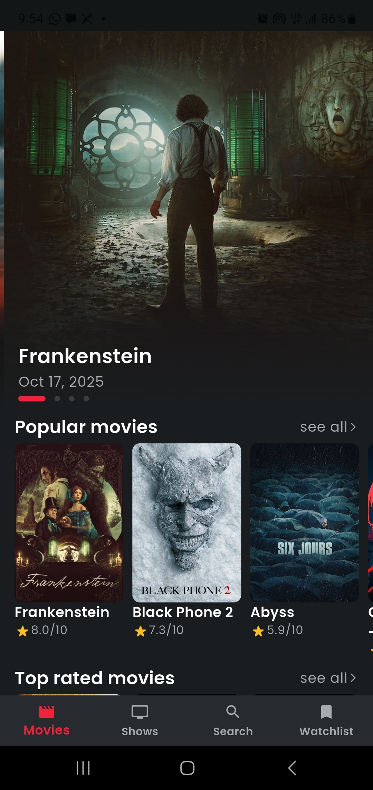
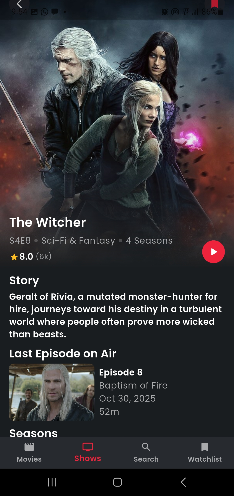
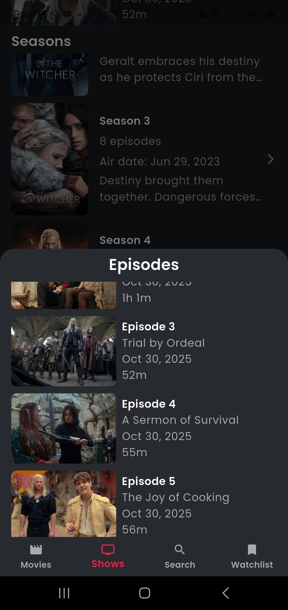
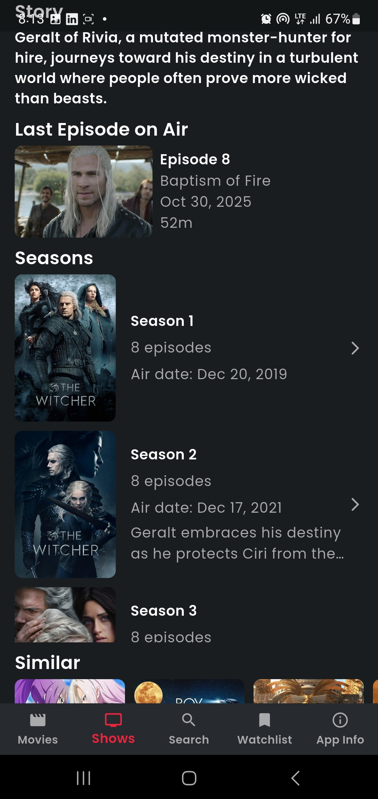
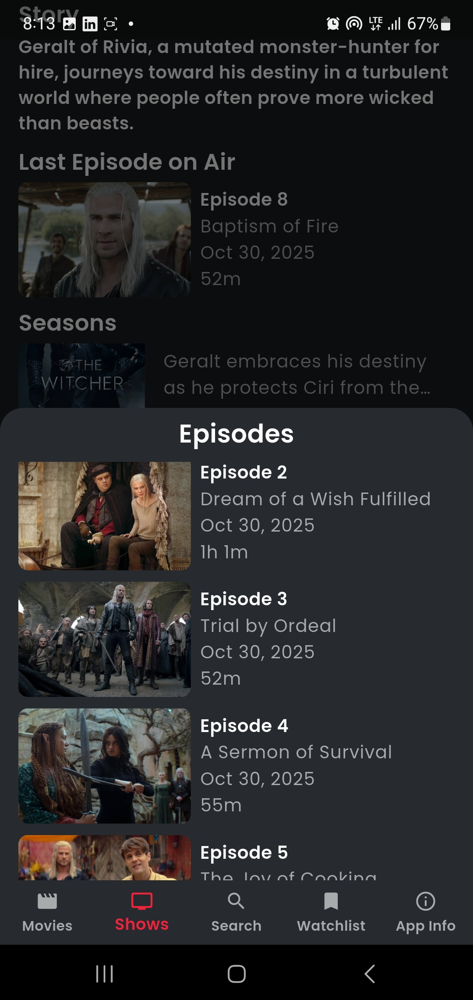
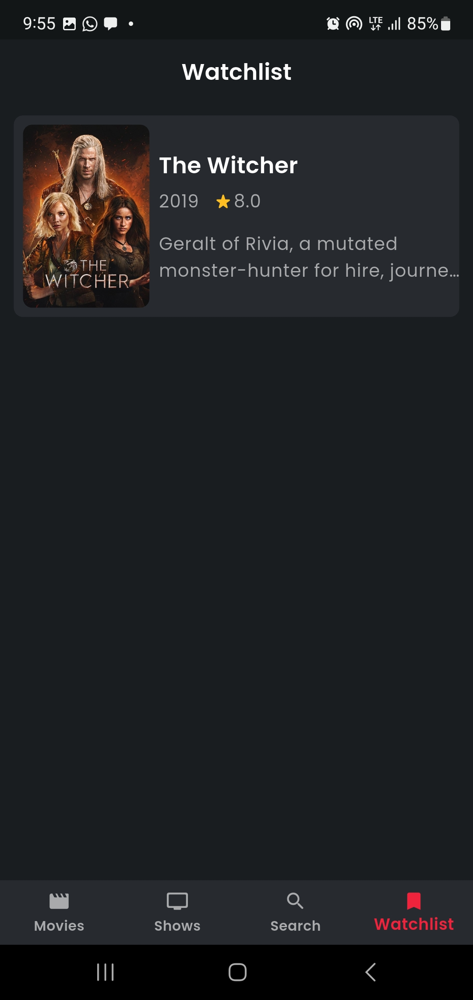
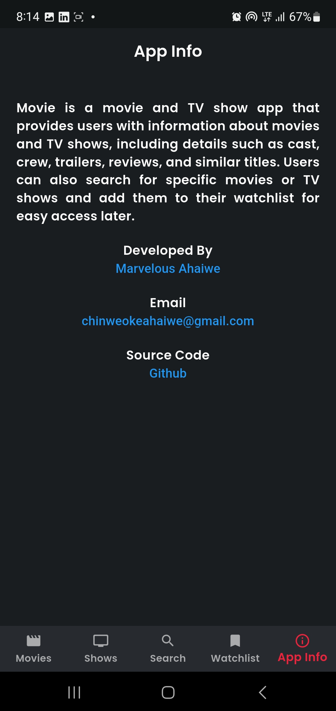

# Movie App

A Flutter movie app built with clean architecture using BLoC, Hive, and The Movie DB API. It displays the latest movies and TV shows with detailed information, including reviews, runtime, and ratings.

## Features

- Search feature
- Watchlist feature
- Now playing movies
- Popular movies
- Top rated movies
- Movie details
- Movie cast
- Movie reviews
- Similar movies
- On air tv shows
- Popular tv shows
- Top rated tv shows
- TV show details
- Similar tv shows
- TV show season details

## App Download
- Click to download app [Download](https://i.diawi.com/aAquBJ)

## Screenshots
<p float="left" align="center">
   
   
  
  
  
  
  

</p>

## ⚙️ Tech Stack

- Framework: Flutter

- Architecture: Clean Architecture

- State Management: BLoC (Business Logic Component)

- Local Storage: Hive

- Networking: The Movie DB API

- Language: Dart

## Installation

### 1. Clone the repo

```bash
git clone https://github.com/Marvelousahaiwe/Flutter-Movie-App.git
cd flutter-movie-app
```

### 2. Run pub get

```bash
flutter pub get
```

### 3. Set up environment variables

Copy `.env.example` to `.env` and add your TMDB API key and base URL:

```
API_KEY=your_api_key_here
API_BASE_URL=https://api.themoviedb.org/3
```

### 4. Run the app

```bash
flutter run
```

## Developer

- [Marvelous Ahaiwe](https://www.linkedin.com/in/marvelous-ahaiwe-31488b184)


